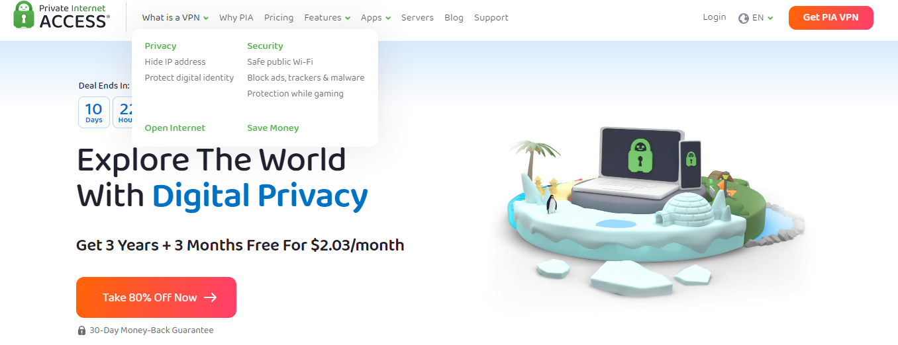

# 分享四个超好用的电脑翻墙梯子软件，靠谱的科学上网梯子工具
PC梯子,电脑梯子,梯子TOP推荐（持续更新） PC/Mac/iPhone好用梯子 推荐翻墙梯子软件 科学上网梯子工具 海外加速器梯子 国外vpn 靠谱iPhone/iPad/安卓/Android/Mac/Linux/PC/路由器都可以用的梯子

分享四个稳定好用的电脑梯子软件，测试下来都是靠谱的科学上网利器，其中包含V2ray节点以及Trojan节点，可以配合V2rayN，SHADOWSOCKS第三方客户端使用，也可以用他们官网自带客户端。

有一说一，现在想找个好用稳定的梯子是真难，如果要长期好用稳定更是难上加难强人锁男，所以干脆给大家分享下我自己在用的几个品牌，都是年份比较久，而且总体来说稳定安全高效靠谱的，毕竟我选梯子之前会习惯性去网上翻品牌资料，但凡有一点疑点槽点不确定性我都不会用，这几个电脑梯子在我看来还是比较不错的。

# 一、Westworld梯子

✅ 网址：https://xbsj3462.fun/i/ask035

✅ 来自欧洲的一款梯子，不过不用担心，他们官网有中英双语，支持大陆用户注册使用，为什么把它放第一位？因为这是我迄今为止用的最久，感觉最好，并且觉得稳定性速度各方面表现最不错的一款。

✅ 当初某不热爆火的那段时间，我就在用，最开始支持ssr节点，后来陆续整改成V2ray以及Trojan节点，线路和速度以及防封能力也是逐渐提升，直到目前没出现登录不上或者断线断流等情况。

✅ Westworld支持电脑，手机同时登陆使用，ios，安卓系统也都有独立客户端，总而言之，不管你手头在用什么设备，都可以用这款软件。

✅ 而且不记录日志，2048位加密超强隐私保护等优点，也让它成为美国、德国最喜欢的电脑梯子之一。

✅ 对于新用户还提供三天免费超长试用时间，降低用户试错成本。

✅ 用Youtube测速过，1080P和4K速度都能跑满不卡顿，很不错。

# 二、Express梯子

✅ 这也是老生常谈的一款梯子了，说句真心话，除了贵没什么缺点，但贵是它的缺点吗？不，是我的缺点。

✅ 不限制网速，后台有一百六十多条节点可以选择，拥有众多的独立IP，这些都是它的优点，并且客服回消息回的也很及时。

# 三、LVACY梯子

✅ 这是来自美国的电脑梯子品牌，在大陆运营的时间也挺久了，外网上的评价颇高，不过我个人用的时间不是太久，买过一段时间会员，后来因为种种原因丢在收藏夹里吃灰了，但总体上来说，对于手头没有梯子的小伙伴而言，这款梯子还是值得一用的。

# 四、PIA

✅ 这个电脑梯子软件其他没有特别亮的亮点，就有一点比较突出，相比于普通梯子支持六七台设备同时使用，它支持十台设备，比别的梯子足足多出了三台，但我总感觉比较鸡肋，除了黄牛倒卖，谁会同时用这么多设备同时登陆呢。

✅ 至于速度和稳定性方面也是中规中矩，感觉是还不错，可以作为备用梯子。

### 以上就是我自己这几年用过的电脑梯子软件，说句实话，几个梯子都还不错，只不过根据个人喜好不同有所取舍，大家也可以根据自己的喜恶偏好选一款。
